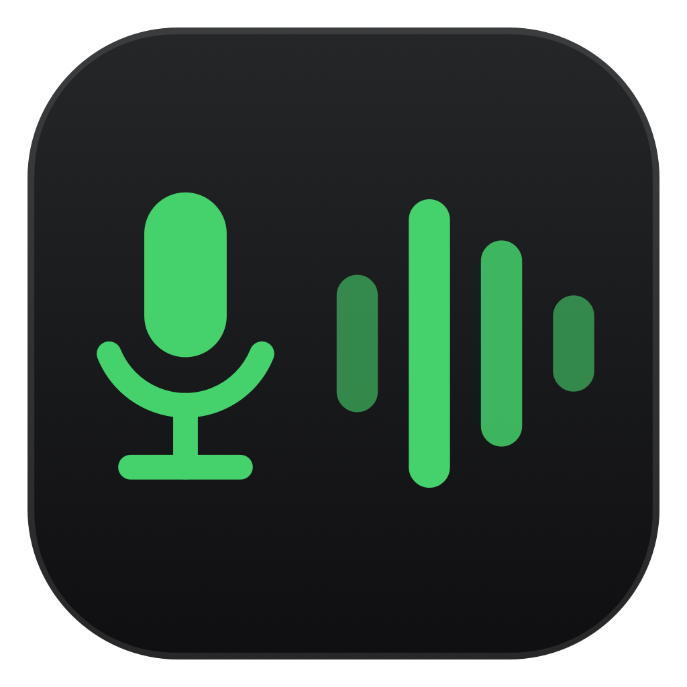

<p align="center">
  
</p>

<h1 align="center">VozLivre</h1>

<p align="center"><b>Você fala, o computador escreve. Tudo dentro do seu Mac.</b></p>

<p align="center"><i>Falar é mais rápido do que digitar.</i></p>

---

Aperta **Caps Lock duas vezes**, fala, aperta de novo. O texto aparece onde o cursor
estiver — no e-mail, no WhatsApp, no editor de código, em qualquer lugar.

Nada da sua voz sai do computador. Funciona sem internet.

---

## O problema que ele resolve

Ditado comum entende português. O que ele não entende é **o jeito que a gente fala de
verdade**, misturando inglês no meio da frase:

| Você fala | Ditado comum escreve | VozLivre escreve |
|---|---|---|
| "o **webhook** do **Stripe** deu **timeout**" | "o **e-book** do **strip** deu **time out**" | ✅ certo |
| "faz o **rollback** do **commit**" | "faz o **um roubo aqui** do commit" | ✅ certo |
| "abre um **pull request**" | "abre um **puro request**" | ✅ certo |

O ditado comum ouve uma palavra em inglês e tenta escrever do jeito que soa. O VozLivre
recebe um aviso antes de cada frase dizendo que palavras técnicas continuam em inglês —
e você pode acrescentar as suas.

---

## O que melhorou

**Quantas palavras em inglês ele acerta**

```
antes  ███████████████░░░░░░░░░░░░░░  75%
agora  ██████████████████████████░░░░  94%
```

**Quanto tempo até o texto aparecer** (menor é melhor)

```
antes  ██████████████████████████████  2,50 s
agora  █████████░░░░░░░░░░░░░░░░░░░░░  0,75 s     3× mais rápido
```

**Tamanho do programa** (menor é melhor)

```
antes  ██████████████████████████████  2,9 GB
agora  ██████████░░░░░░░░░░░░░░░░░░░░  1,0 GB     quase 3× menor
```

**Memória usada enquanto trabalha** (menor é melhor)

```
antes  ██████████████████████████████  3,85 GB
agora  ██████████████░░░░░░░░░░░░░░░░  1,86 GB    e ela se libera sozinha
```

E um problema que sumiu: se você ligasse o ditado e **ficasse em silêncio**, o programa
inventava frases do nada — chegou a escrever *"Legenda por Sônia Ruberti"* e
*"Inscreva-se no canal"*. Isso ia direto pro seu texto. Agora silêncio dá silêncio.

---

## Como usar

1. **Caps Lock, Caps Lock** — uma pílula aparece na tela com a onda da sua voz
2. **Fale** normalmente
3. **Caps Lock, Caps Lock** — o texto é escrito onde o cursor está

Não precisa segurar tecla nenhuma. E como são dois toques (duas viradas), **o Caps Lock
volta como estava** — não fica maiúscula presa.

No ícone do microfone, na barra de menu, você pode:

- **Meu vocabulário…** — escrever as palavras que ele errar, uma por linha
- **Trocar o atalho** — duplo toque em outra tecla, ou voltar ao "segurar pra falar"
- **Desligar a onda na tela** ou o aviso sonoro

---

## Instalação

Precisa de um Mac com chip Apple (M1 ou mais novo), macOS 26+, e o `cmake`
(`brew install cmake`).

```bash
git clone https://github.com/edneyjunior-2/vozlivre.git
cd vozlivre
./scripts/preparar.sh          # baixa e prepara o reconhecimento (~1 GB, uma vez só)
./scripts/montar-e-instalar.sh # instala e abre
```

Na primeira vez o Mac vai pedir duas permissões: **Microfone** (óbvio) e
**Acessibilidade** (necessária pra ele conseguir escrever o texto pra você).

---

## Sua voz não vai para lugar nenhum

- **Não existe nenhuma linha de código** no programa que fale com a internet
- O reconhecimento inteiro (1 GB) mora dentro do próprio aplicativo
- O áudio vira um arquivo temporário por 2 segundos e é apagado
- **Funciona em modo avião**

Diferente do ditado da Apple, que dependendo da configuração manda seu áudio para os
servidores deles.

---

## Os testes por trás das decisões

Nada aqui foi escolhido por opinião. Cada ideia foi medida num Mac M5 de 16 GB, com 12
frases, 34 palavras difíceis e duas vozes — metade dos testes com barulho de fundo.

### Até onde dá pra encolher o reconhecimento

O "cérebro" do programa é uma tabela gigante de números. Dá pra guardar esses números com
menos precisão e economizar espaço — como salvar uma foto em JPEG. A pergunta é: **até
onde dá pra apertar antes de estragar?**

```
                  tamanho          erro em áudio limpo (menor é melhor)
original  2,88 GB  ██████████████   3,8%  ██████████
nível 8   1,54 GB  ████████         3,8%  ██████████   igual
nível 5   1,01 GB  █████            3,8%  ██████████   igual  ← escolhido
nível 4   0,83 GB  ████             5,8%  ███████████████  piorou
```

**O limite é o nível 5.** Ali o programa fica quase 3× menor sem errar mais nada. No nível
seguinte o erro sobe de 3,8% para 5,8%, e economiza só mais 180 MB. Não vale.

### Ideias testadas e reprovadas

| Ideia | O que aconteceu no teste | |
|---|---|---|
| Comprimir mais (nível 4) | erro sobe de 3,8% → 5,8% por só 180 MB | ❌ |
| Encurtar a janela de análise | erro quase dobra: 3,8% → 6,7% | ❌ |
| Usar a Neural Engine do chip | somaria 1,2 GB ao programa; o "3× mais rápido" que se lê por aí é comparado com processador comum, não com a placa gráfica que já usamos | ❌ |
| Trocar por um modelo "turbo" | 2× mais rápido, mas erra 4 das 8 palavras em inglês (contra 1) | ❌ |
| Trocar pelo Parakeet (NVIDIA) | não aceita vocabulário personalizado — perderia justamente o que faz o português misturado funcionar | ❌ |
| Remover os idiomas que não uso | não é possível: os idiomas não ficam em gavetas separadas, é uma malha única. E o que ele sabe de inglês é parte do que faz "webhook" sair certo | ❌ |

### Uma armadilha que quase nos pegou

Existe uma recomendação comum na internet de usar a opção `-mc 0` para áudio curto. Lendo
o código-fonte do motor, descobrimos que **essa opção desliga o aviso de vocabulário por
completo** — teria anulado silenciosamente a maior melhoria do projeto.

---

## Como funciona por dentro

```
Caps Lock 2×  →  grava o áudio        →  detector de fala corta o silêncio
                 (e desenha a onda)       →  reconhecimento + dica de vocabulário
                                             →  texto no cursor
```

O reconhecimento ([whisper.cpp](https://github.com/ggml-org/whisper.cpp)) roda **dentro do
aplicativo**, não como programa separado. Antes, cada ditado abria um programa novo que
carregava 1 GB do zero, trabalhava meio segundo e morria — só isso era mais da metade da
espera.

Agora o carregamento **começa no instante em que você aperta pra falar**, então acontece
enquanto você ainda está falando e desaparece da conta. Depois de 10 minutos parado — ou
assim que o Mac avisa que está com pouca memória — ele solta tudo.

---

## Testar por conta própria

```bash
swift build --product TesteMotor -c release
./.build/release/TesteMotor Vendor/whisper/ggml-large-v3-q5_0.bin \
                            Vendor/whisper/ggml-silero-v5.1.2.bin \
                            seu-audio.wav
```

Mostra quanto tempo levou pra carregar, quanto levou pra transcrever, e confere se
silêncio devolve vazio mesmo.

---

## Créditos

- [whisper.cpp](https://github.com/ggml-org/whisper.cpp) — o motor (MIT)
- [Whisper](https://github.com/openai/whisper), da OpenAI — o modelo (MIT)
- [Silero VAD](https://github.com/snakers4/silero-vad) — o detector de fala

## Licença

MIT — veja [LICENSE](LICENSE).
